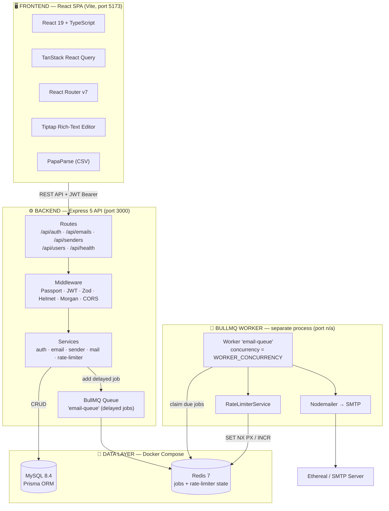
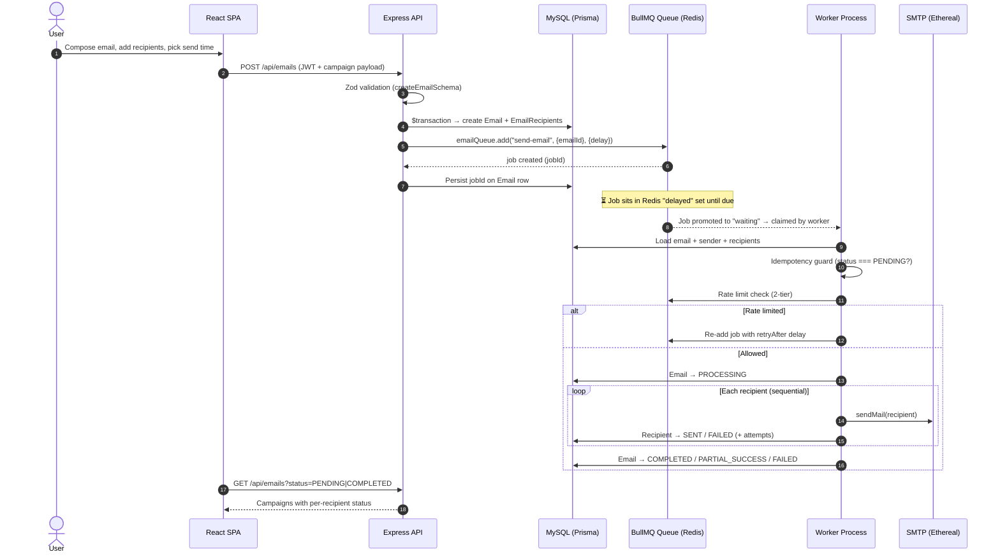
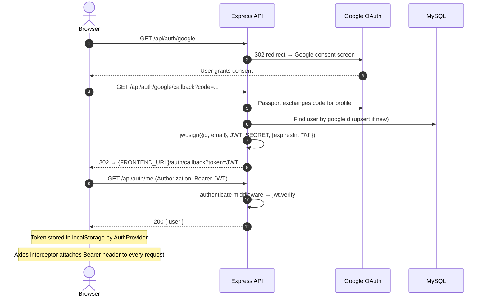
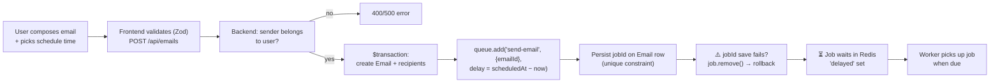
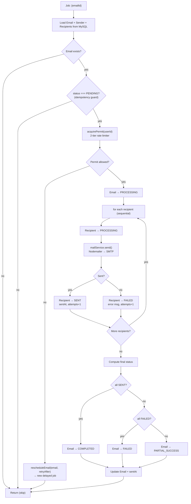
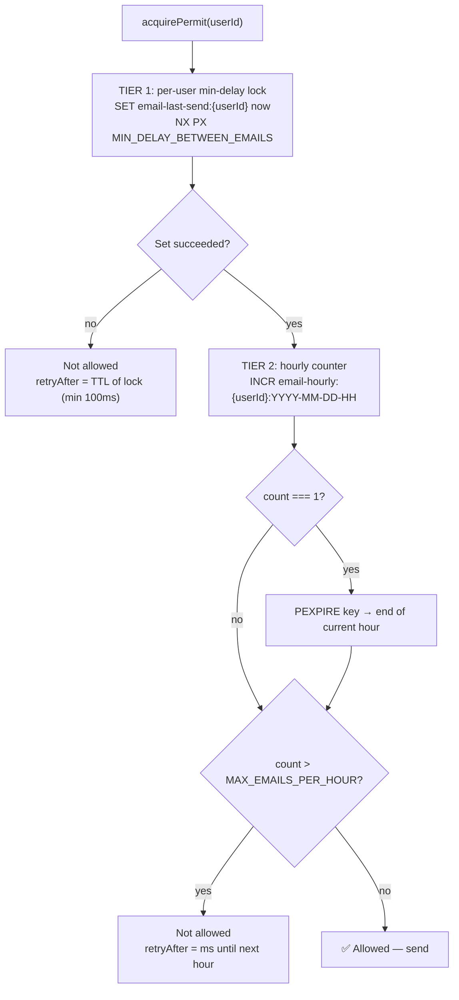
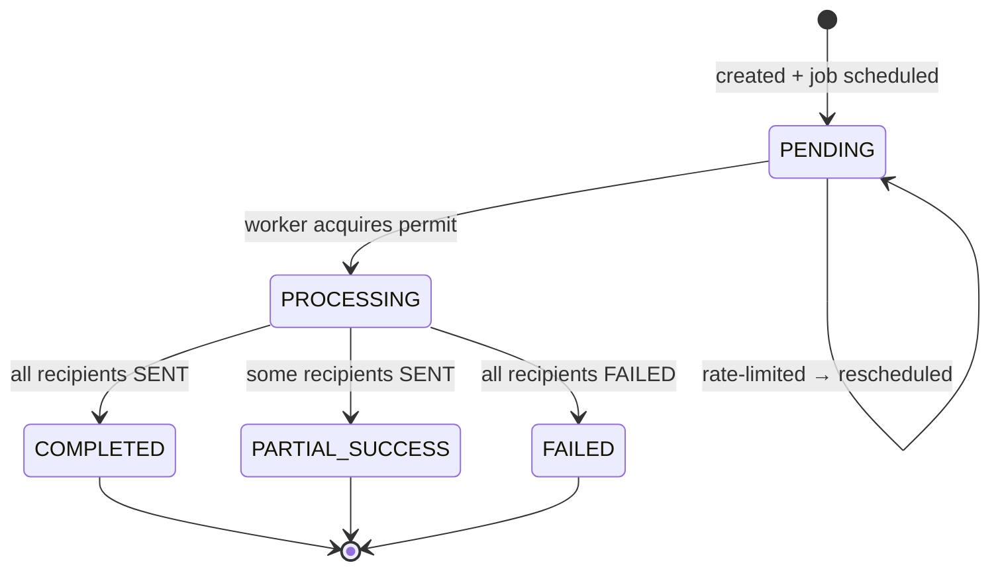
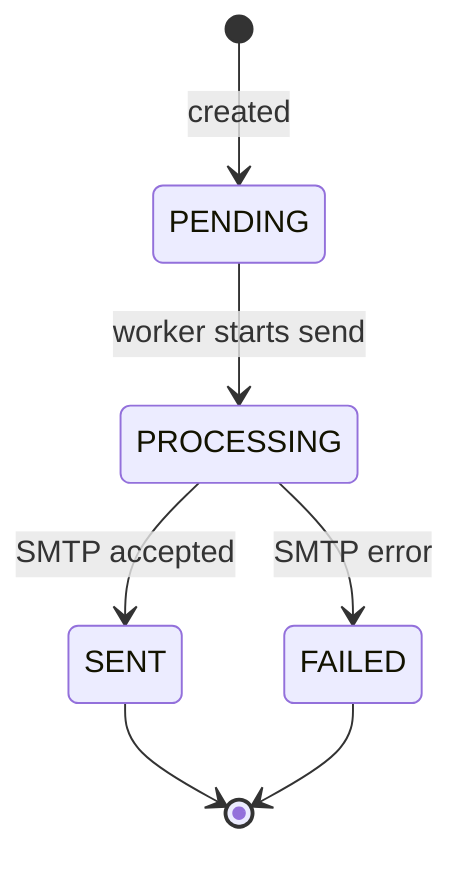
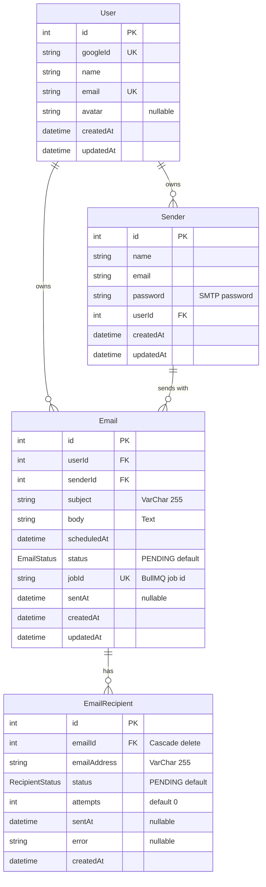
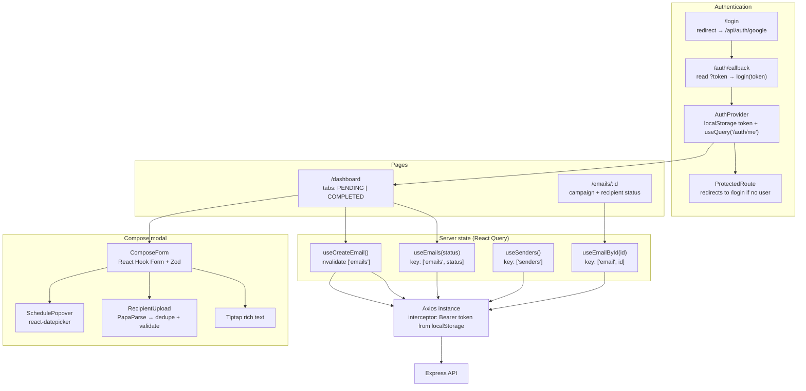

# 📧 Lifafa

A production-inspired email scheduling platform that enables users to authenticate with Google, compose rich-text emails, upload recipient lists via CSV, and schedule email campaigns for future delivery.

Built with **React 19**, **Express 5**, **TypeScript**, **BullMQ**, **Redis**, and **MySQL** — providing reliable delayed email scheduling with persistent job storage, configurable concurrency, rate limiting, and delivery delays.

<p align="center">
  
  
  
  
  
  
  
</p>

---

## Table of Contents

- [Features](#features)
- [Tech Stack](#tech-stack)
- [System Architecture](#system-architecture)
- [End-to-End Flow](#end-to-end-flow)
- [Authentication Flow](#authentication-flow)
- [Email Scheduling Flow](#email-scheduling-flow)
- [Worker Processing Flow](#worker-processing-flow)
- [Rate Limiting Flow](#rate-limiting-flow)
- [State Machines](#state-machines)
- [Database Schema](#database-schema)
- [Frontend Data Flow](#frontend-data-flow)
- [Project Structure](#project-structure)
- [Getting Started](#getting-started)
- [Environment Variables](#environment-variables)
- [Persistence After Restart](#persistence-after-restart)
- [Worker Concurrency](#worker-concurrency)
- [Delay Between Emails](#delay-between-emails)
- [Hourly Rate Limiting](#hourly-rate-limiting)
- [Trade-offs & Assumptions](#trade-offs--assumptions)
- [Known Limitations & Ideas for Improvement](#known-limitations--ideas-for-improvement)
- [Demo](#demo)
- [License](#license)

---

## Features

### Authentication

- 🔐 Google OAuth 2.0 Login
- 🎫 JWT-based session management (7-day expiry)
- 🛡️ Protected routes with middleware guards
- 👤 User profile with Google avatar
- 🚪 Secure logout support

### Email Scheduling

- ✍️ Compose rich-text emails with a full-featured editor (bold, italic, underline, lists, alignment)
- 📎 Upload recipient lists through CSV files (parsed with PapaParse)
- ⏰ Schedule emails for future delivery with a date-time picker
- ⏱️ Configurable minimum delay between individual emails (per-user Redis lock)
- 📊 Configurable hourly sending limit per user (Redis fixed-window counter)
- 👥 Multiple sender account support (per-user SMTP credentials)
- 📈 Per-recipient email status tracking (`PENDING` → `PROCESSING` → `SENT` / `FAILED`)

### Dashboard

- 📋 **Scheduled Emails** — view all pending campaigns
- ✅ **Sent Emails** — view completed campaigns
- 🔍 **Email Details** — drill into any campaign to see per-recipient delivery status
- ⏳ Loading spinner states
- 📭 Empty states when no data exists
- 📐 Responsive sidebar-based layout

### Backend

- 🔄 BullMQ delayed jobs with millisecond-precision scheduling
- 💾 Redis-backed persistent queue — jobs survive server restarts
- ⚙️ Configurable worker concurrency via environment variable
- 🚦 Two-tier rate limiting: per-email delay + hourly cap (both stored in Redis)
- ✅ Idempotent email processing — only `PENDING` jobs are executed
- 🔁 Automatic rescheduling when rate limits are hit
- 📧 SMTP email delivery via Nodemailer (Ethereal Email for testing)
- 🔒 Request validation with Zod schemas
- 🪖 Security headers via Helmet
- 📝 HTTP request logging via Morgan

---

## Tech Stack

### Frontend

| Technology | Purpose |
|:--|:--|
| [React 19](https://react.dev/) | UI library |
| [Vite](https://vite.dev/) | Build tool & dev server |
| TypeScript | Type safety |
| [Tailwind CSS v4](https://tailwindcss.com/) | Utility-first styling |
| [TanStack React Query](https://tanstack.com/query) | Server state management & data fetching |
| [React Router v7](https://reactrouter.com/) | Client-side routing |
| [React Hook Form](https://react-hook-form.com/) + [Zod](https://zod.dev/) | Form handling & validation |
| [Tiptap](https://tiptap.dev/) | Rich-text email editor |
| [shadcn/ui](https://ui.shadcn.com/) | Accessible UI component primitives |
| [Axios](https://axios-http.com/) | HTTP client (with JWT interceptor) |
| [PapaParse](https://www.papaparse.com/) | CSV parsing |
| [Sonner](https://sonner.emilkowal.dev/) | Toast notifications |
| Phosphor Icons + Lucide React | Iconography |

### Backend

| Technology | Purpose |
|:--|:--|
| [Node.js](https://nodejs.org/) | Runtime |
| [Express 5](https://expressjs.com/) | HTTP framework |
| TypeScript | Type safety |
| [Prisma ORM](https://www.prisma.io/) | Database ORM (with MariaDB adapter) |
| MySQL 8.4 | Relational database |
| [Redis 7](https://redis.io/) | Job queue backing store & rate limiter state |
| [BullMQ](https://docs.bullmq.io/) | Delayed job queue & worker framework |
| [Passport.js](https://www.passportjs.org/) | Google OAuth 2.0 strategy |
| [JWT](https://jwt.io/) | Stateless authentication tokens |
| [Nodemailer](https://nodemailer.com/) | SMTP email delivery |
| [Zod](https://zod.dev/) | Request validation |
| [Helmet](https://helmetjs.github.io/) | Security headers |
| [Morgan](https://github.com/expressjs/morgan) | HTTP logging |

### Infrastructure

| Technology | Purpose |
|:--|:--|
| Docker Compose | Orchestrate MySQL & Redis containers |
| MySQL 8.4 (container) | Persistent data store |
| Redis 7 Alpine (container) | Queue storage & rate limiter state |

---

## System Architecture

The application follows a **client-server architecture** with **three long-running processes**:

1. **Frontend** — React SPA served by Vite (port `5173`)
2. **Backend** — Express 5 REST API (port `3000`)
3. **Worker** — a separate BullMQ worker process that consumes scheduled jobs



**📂 Files used in this flow:**

- `frontend/src/main.tsx` — app bootstrap (QueryClientProvider + AuthProvider)
- `frontend/src/App.tsx` — route definitions
- `frontend/src/lib/axios.ts` — API client (base URL + JWT interceptor)
- `backend/src/server.ts` — API entrypoint (DB connect + listen)
- `backend/src/worker.ts` — worker entrypoint (starts BullMQ worker)
- `backend/src/app.ts` — Express app assembly (middleware + routers)
- `backend/src/config/env.ts` — all environment variables
- `backend/src/config/redis.ts` — shared Redis connection (queue + rate limiter)
- `backend/src/config/prisma.ts` — Prisma client with MariaDB adapter
- `backend/src/queues/email.queue.ts` — BullMQ queue definition + `schedule()`
- `backend/src/workers/email.worker.ts` — job processor
- `backend/src/services/mail.service.ts` — Nodemailer SMTP transport
- `docker-compose.yml` — MySQL + Redis containers

**Key architectural decisions:**

- **Separate worker process** (`npm run worker`) — the Express API never blocks on sending emails; jobs are processed independently and the worker can be scaled horizontally.
- **Redis is the single source of truth for job timing** — BullMQ stores jobs in Redis; MySQL stores the *state* of each campaign and recipient.
- **Delayed jobs instead of cron** — each campaign is enqueued with `delay = scheduledAt - now`, so no background timer/polling is needed in the API.

---

## End-to-End Flow



**📂 Files used in this flow:**

- `frontend/src/components/compose/ComposeModal.tsx` — compose modal (form + submit)
- `frontend/src/api/email.ts` — `createEmail()` / `getEmails()` API calls
- `frontend/src/hooks/useCreateEmail.ts` — mutation + query invalidation
- `frontend/src/hooks/useEmails.ts` — `["emails", status]` query
- `backend/src/routes/email.route.ts` — route registration + JWT guard
- `backend/src/controllers/email.controller.ts` — request handlers
- `backend/src/validators/email.validator.ts` — Zod `createEmailSchema`
- `backend/src/services/email.service.ts` — transaction, scheduling, rescheduling
- `backend/src/queues/email.queue.ts` — `emailQueue.add("send-email", {emailId}, {delay})`
- `backend/src/workers/email.worker.ts` — job processor (the pipeline)
- `backend/src/services/rate-limiter.service.ts` — `acquirePermit(userId)`
- `backend/src/services/mail.service.ts` — `send()` via Nodemailer

---

## Authentication Flow

Authentication is implemented using **Google OAuth 2.0** (Passport.js) and **JWT** (7-day expiry, stateless).



**📂 Files used in this flow:**

- `frontend/src/pages/Login.tsx` — "Sign in with Google" redirect to `/api/auth/google`
- `frontend/src/pages/AuthCallback.tsx` — reads `?token=` from URL and calls `login(token)`
- `frontend/src/providers/AuthProviders.tsx` — token state + `useQuery(["me"])`
- `frontend/src/routes/ProtectedRoute.tsx` — redirects to `/login` when unauthenticated
- `frontend/src/lib/axios.ts` — request interceptor injects `Bearer` token
- `backend/src/routes/auth.route.ts` — `/google`, `/google/callback`, `/me` routes
- `backend/src/config/passport.ts` — Google OAuth strategy (verify callback)
- `backend/src/controllers/auth.controller.ts` — callback handler (JWT → redirect)
- `backend/src/services/auth.service.ts` — upsert user + `jwt.sign`
- `backend/src/middlewares/jwt.middleware.ts` — `authenticate` guard (`jwt.verify`)
- `backend/src/config/env.ts` — `GOOGLE_CLIENT_ID`, `GOOGLE_CLIENT_SECRET`, `JWT_SECRET`, `FRONTEND_URL`

**Step-by-step:**

1. The user clicks **"Sign in with Google"** → frontend redirects to `GET /api/auth/google`.
2. Passport's Google strategy redirects the browser to Google's consent screen.
3. After consent, Google redirects to `/api/auth/google/callback?code=...`.
4. Passport exchanges the code and invokes the strategy callback (profile → `req.user`).
5. `authService.handleGoogleLogin()` upserts the user in MySQL (keyed by `googleId`).
6. A JWT is signed (`id`, `email`, 7-day expiry) and the browser is redirected to `/auth/callback?token=<jwt>`.
7. The frontend stores the token and the Axios request interceptor attaches `Authorization: Bearer <token>` to every API call.
8. Protected routes validate the token via `jwt.middleware.ts` (`authenticate`), which sets `req.currentUser`.

---

## Email Scheduling Flow



**📂 Files used in this flow:**

- `frontend/src/components/compose/ComposeForm.tsx` — form fields (sender, recipients, subject, body)
- `frontend/src/components/compose/SchedulePopover.tsx` — date-time picker (`scheduledAt`)
- `frontend/src/components/compose/RecipientUpload.tsx` — CSV parsing via PapaParse
- `frontend/src/api/email.ts` — `createEmail()` API call
- `backend/src/controllers/email.controller.ts` — `create` handler (Zod parse + service call)
- `backend/src/validators/email.validator.ts` — validation rules (future `scheduledAt`)
- `backend/src/services/email.service.ts` — `create()`: sender check → `$transaction` → `scheduleEmail()`
- `backend/src/queues/email.queue.ts` — `schedule()` computes `delay = scheduledAt − now`
- `backend/prisma/schema.prisma` — `Email` + `EmailRecipient` models

> **Why transaction → queue → jobId?** The campaign is only created *after* the DB transaction commits, and the BullMQ job is only "trusted" after its `jobId` is persisted on the `Email` row. If persisting the `jobId` fails, the queue job is removed (compensation), so a job can never reference a missing/unscheduled campaign.

### Update & Delete semantics

- Only `PENDING` emails can be updated/deleted (`updateEmail`, `deleteEmail`).
- Updating removes the **old BullMQ job** first, replaces recipients in a transaction, then schedules a **new** job.
- Deleting removes the queued job, then deletes the campaign (recipients cascade via `onDelete: Cascade`).

---

## Worker Processing Flow

The worker (`backend/src/workers/email.worker.ts`) processes each job with the following pipeline:



**📂 Files used in this flow:**

- `backend/src/workers/email.worker.ts` — the entire pipeline (guard → permit → send → status)
- `backend/src/services/rate-limiter.service.ts` — `acquirePermit(userId)` (2-tier check)
- `backend/src/services/email.service.ts` — `rescheduleEmail()` for rate-limit retries
- `backend/src/services/mail.service.ts` — `send()` (Nodemailer → SMTP)
- `backend/src/config/prisma.ts` — DB access for status updates
- `backend/src/config/env.ts` — `WORKER_CONCURRENCY`, `MIN_DELAY_BETWEEN_EMAILS`, `MAX_EMAILS_PER_HOUR`
- `backend/prisma/schema.prisma` — `EmailStatus` / `RecipientStatus` enums

**Guarantees & behaviors:**

- **Idempotency** — a job is only executed if the campaign is still `PENDING`; re-delivered jobs (e.g., after a crash/retry) are skipped.
- **Per-recipient granularity** — each recipient gets its own `SENT`/`FAILED` status, `attempts` counter, and error message; one bad address doesn't block the others.
- **Sequential within a campaign** — recipients are sent one-by-one to respect rate limits; parallelism comes from `WORKER_CONCURRENCY` across campaigns.
- **Rescheduling** — if the rate limiter denies the permit, the job is re-added to the queue with `retryAfter` delay; no recipients are lost.

---

## Rate Limiting Flow

Two independent tiers, both stored in Redis:



**📂 Files used in this flow:**

- `backend/src/services/rate-limiter.service.ts` — `acquirePermit()` (both tiers)
- `backend/src/config/redis.ts` — shared Redis connection
- `backend/src/config/env.ts` — `MIN_DELAY_BETWEEN_EMAILS`, `MAX_EMAILS_PER_HOUR`
- `backend/src/workers/email.worker.ts` — calls `acquirePermit` before sending
- `backend/src/services/email.service.ts` — `rescheduleEmail()` when denied

| Scenario | Behavior |
|:--|:--|
| `MIN_DELAY_BETWEEN_EMAILS` not yet elapsed | Job rescheduled with the lock's remaining TTL |
| Hourly cap reached | Job rescheduled to resume after the hour window resets |
| Redis counter expiry | Auto-resets at the start of each new hour (`PEXPIRE`) |
| No recipient information lost | The job is re-queued with a computed `retryAfter` delay |

---

## State Machines

### Campaign (`Email.status`)



**📂 Files used in this flow:**

- `backend/prisma/schema.prisma` — `EmailStatus` enum definition
- `backend/src/workers/email.worker.ts` — transitions to `PROCESSING`, `COMPLETED`, `PARTIAL_SUCCESS`, `FAILED`
- `backend/src/services/email.service.ts` — `FAILED` on scheduling error; rescheduling keeps `PENDING`
- `backend/src/controllers/email.controller.ts` — only `PENDING` emails are updatable/deletable

### Recipient (`EmailRecipient.status`)



**📂 Files used in this flow:**

- `backend/prisma/schema.prisma` — `RecipientStatus` enum definition
- `backend/src/workers/email.worker.ts` — sets `PROCESSING`, then `SENT` / `FAILED` (+ `attempts`, `error`, `sentAt`)

---

## Database Schema



**📂 Files used in this flow:**

- `backend/prisma/schema.prisma` — the 4 models + 2 enums + relations + indexes
- `backend/prisma/migrations/` — migration history (init → Email → Sender → multi-recipient)

**Model notes:**

- **`User`** — Google-authenticated profile (`googleId` unique, `email` unique).
- **`Sender`** — per-user SMTP sender accounts; each holds its own SMTP `email` + `password` for multi-sender support.
- **`Email`** — campaign metadata; `jobId` (unique) links the campaign to its BullMQ job; indexes on `userId`, `senderId`, `status`, `scheduledAt`.
- **`EmailRecipient`** — per-recipient delivery state; `attempts` and `error` enable granular debugging; cascades on campaign delete.

---

## Frontend Data Flow



**📂 Files used in this flow:**

- `frontend/src/main.tsx` — `QueryClientProvider` + `AuthProvider` setup
- `frontend/src/App.tsx` — routes (`/login`, `/auth/callback`, `/dashboard`, `/emails/:id`)
- `frontend/src/providers/AuthProviders.tsx` — auth context (token + `/auth/me` query)
- `frontend/src/routes/ProtectedRoute.tsx` — route guard
- `frontend/src/lib/axios.ts` — Axios instance + Bearer interceptor
- `frontend/src/pages/Login.tsx` — OAuth redirect trigger
- `frontend/src/pages/AuthCallback.tsx` — token capture from URL
- `frontend/src/pages/Dashboard.tsx` — tabs + counts + compose modal
- `frontend/src/pages/EmailDetails.tsx` — per-recipient status view
- `frontend/src/hooks/useEmails.ts` / `useCreateEmail.ts` / `useSenders.ts` — queries + mutation
- `frontend/src/api/auth.ts` / `email.ts` / `sender.ts` — API functions
- `frontend/src/components/compose/ComposeModal.tsx` — form assembly (RHF + Zod)

**Frontend highlights:**

- The Axios request interceptor attaches the JWT from `localStorage` to every request.
- React Query keys (`['emails', status]`, `['email', id]`, `['me']`) keep the dashboard, details page, and auth state in sync; `useCreateEmail` invalidates the emails list after a successful mutation.
- CSV upload parses client-side with PapaParse, detects the email column by header name (`email`, `email address`, `recipient`, `recipient email`), dedupes, lowercases, and validates addresses with a regex before merging into the form.

---

## Project Structure

```
email-job-scheduler/
│
├── backend/
│   ├── prisma/
│   │   ├── migrations/          # Database migration history
│   │   └── schema.prisma        # Data models (User, Email, EmailRecipient, Sender)
│   ├── src/
│   │   ├── config/              # env, redis, prisma, passport setup
│   │   ├── controllers/         # Route handlers (auth, email, sender, user, health)
│   │   ├── middlewares/         # JWT auth guard, error middleware
│   │   ├── queues/              # BullMQ queue + EmailQueue.schedule()
│   │   ├── routes/              # Express routers (mounted in app.ts)
│   │   ├── services/            # Business logic (auth, email, sender, mail, rate-limiter)
│   │   ├── workers/             # email.worker.ts — BullMQ worker processor
│   │   ├── types/               # Shared TS types + express.d.ts augmentation
│   │   ├── utils/               # ApiResponse, AppError, asyncHandler
│   │   ├── validators/          # Zod schemas
│   │   ├── app.ts               # Express app assembly
│   │   ├── server.ts            # Entrypoint — DB connect + listen (npm run dev)
│   │   ├── worker.ts            # Entrypoint — start BullMQ worker (npm run worker)
│   │   └── test.job.ts          # Dev script to inspect a job's state
│   ├── package.json
│   └── tsconfig.json
│
├── frontend/
│   ├── src/
│   │   ├── api/                 # Axios API calls (auth, email, sender)
│   │   ├── components/          # auth, compose, dashboard, ui (shadcn)
│   │   ├── hooks/               # useEmails, useCreateEmail, useSenders
│   │   ├── layouts/             # AppLayout
│   │   ├── lib/                 # Axios instance + interceptors
│   │   ├── pages/               # Login, AuthCallback, Dashboard, EmailDetails
│   │   ├── providers/           # AuthProvider (token + /auth/me)
│   │   ├── routes/              # ProtectedRoute
│   │   ├── services/            # Additional API helpers
│   │   ├── types/               # Email, Sender, User types
│   │   ├── validators/          # Zod schema (createEmailSchema)
│   │   ├── App.tsx              # Router setup
│   │   └── main.tsx             # Entrypoint (QueryClient + AuthProvider)
│   ├── vite.config.ts
│   └── package.json
│
├── docker-compose.yml           # MySQL 8.4 + Redis 7
└── README.md
```

---

## Getting Started

### 1. Prerequisites

- Node.js 20+
- Docker + Docker Compose
- A `.env` file in `backend/` (see [Environment Variables](#environment-variables))
- A `.env` file in `frontend/` with `VITE_API_URL`

### 2. Start Docker Services (MySQL + Redis)

```bash
docker compose up -d
```

### 3. Start the Backend

```bash
cd backend
npm install
npx prisma generate   # generates client into src/generated/prisma (gitignored)
npx prisma migrate deploy
npm run dev           # Express API on http://localhost:3000
```

### 4. Start the BullMQ Worker (second terminal)

```bash
cd backend
npm run worker
```

### 5. Start the Frontend (third terminal)

```bash
cd frontend
npm install
npm run dev           # Vite on http://localhost:5173
```

| Service | URL |
|:--|:--|
| **Frontend** | http://localhost:5173 |
| **Backend API** | http://localhost:3000 |
| **Health check** | http://localhost:3000/api/health |

---

## Environment Variables

### Backend (`backend/.env`)

| Variable | Purpose |
|:--|:--|
| `PORT` | API port (default `3000`) |
| `DATABASE_HOST` / `DATABASE_PORT` / `DATABASE_USER` / `DATABASE_PASSWORD` / `DATABASE_NAME` | MySQL connection (docker-compose defaults: `localhost:3306`, user `root`, password `password`, db `email_scheduler`) |
| `REDIS_HOST` / `REDIS_PORT` | Redis connection (defaults `localhost:6379`) |
| `GOOGLE_CLIENT_ID` / `GOOGLE_CLIENT_SECRET` | Google OAuth app credentials |
| `JWT_SECRET` | Secret for signing JWTs |
| `SMTP_HOST` / `SMTP_PORT` / `SMTP_FROM` | SMTP server for delivery (Ethereal in dev) |
| `WORKER_CONCURRENCY` | Number of jobs the worker processes in parallel (default `3`) |
| `MAX_EMAILS_PER_HOUR` | Hourly sending cap per user |
| `MIN_DELAY_BETWEEN_EMAILS` | Minimum gap (ms) between two sends from the same user |
| `FRONTEND_URL` | Frontend origin for OAuth redirect (e.g. `http://localhost:5173`) |

### Frontend (`frontend/.env`)

| Variable | Purpose |
|:--|:--|
| `VITE_API_URL` | Backend base URL (e.g. `http://localhost:3000/api`) |

---

## Persistence After Restart

Scheduled emails remain reliable even if the backend server is stopped or restarted, thanks to BullMQ's persistent Redis-backed queue.

| Component | Behavior on Restart |
|:--|:--|
| **MySQL** | Campaign metadata persists (Docker volume) |
| **Redis** | Scheduled jobs persist (in-memory; RDB/AOF can be enabled) |
| **Express server** | Restart does not affect queued jobs |
| **BullMQ worker** | Reconnects to Redis and resumes processing pending jobs |

This ensures future campaigns are delivered even after unexpected restarts, as long as the Redis container keeps running.

---

## Worker Concurrency

BullMQ workers support configurable concurrency — multiple campaign jobs processed simultaneously.

```env
WORKER_CONCURRENCY=3
```

| Value | Behavior |
|:--|:--|
| `1` | Jobs processed one at a time (sequential) |
| `3` | Up to 3 jobs in parallel (default) |
| `10+` | Higher throughput for production workloads |

> Recipients *within* one campaign are always sent sequentially; parallelism happens *across* campaigns.

---

## Delay Between Emails

For campaigns with multiple recipients, the worker enforces a minimum gap between consecutive sends per user — implemented as a Redis `SET key value NX PX <ms>` lock (`email-last-send:{userId}`). If a send is attempted before the lock expires, the job is rescheduled with the remaining TTL as the retry delay.

```env
MIN_DELAY_BETWEEN_EMAILS=1000    # milliseconds
```

---

## Hourly Rate Limiting

A Redis fixed-window counter (`email-hourly:{userId}:YYYY-MM-DD-HH`) tracks sends per hour; the key auto-expires at the end of the hour via `PEXPIRE`.

```env
MAX_EMAILS_PER_HOUR=100
```

When the cap is hit, the job is rescheduled to resume after the current hour window resets — no recipients are lost.

---

## Trade-offs & Assumptions

### Assumptions

- **Google OAuth** is the sole authentication mechanism.
- **Ethereal Email** is used for SMTP testing — emails go to virtual inboxes, not real recipients.
- **Redis must be running** before the worker starts.
- **The worker runs as a separate process** — not embedded in the API server.
- **Sender SMTP credentials are stored per-user** in MySQL.

### Trade-offs

| Decision | Rationale |
|:--|:--|
| **Ethereal Email** instead of a production provider | Safe for development; switching to SendGrid/SES/Gmail SMTP requires only config changes |
| **API polling** instead of WebSockets | Simpler; TanStack React Query handles caching and refetching efficiently |
| **Sequential sending** per campaign | Rate-limit compliance + predictable order; parallelism via worker concurrency across campaigns |
| **Basic CSV validation** | Assumes an `email`-like column exists; advanced validation can be added |
| **BullMQ default retry** | Built-in retry covers transient failures; exponential backoff + dead-letter queues can be added |
| **Delayed BullMQ jobs** instead of cron | Millisecond precision, no polling loop, jobs survive restarts |

---

## Known Limitations & Ideas for Improvement

> Useful for code reviews / interviews — honest assessment of what's next.

- **Stuck `PROCESSING` emails** — if the worker crashes mid-campaign, the campaign stays `PROCESSING` forever (the idempotency guard skips non-`PENDING` emails). Fix: a sweeper that resets stale `PROCESSING` rows (e.g., no update for N minutes) back to `PENDING`.
- **Hourly counter counts attempts, not just sends** — `INCR` happens before the cap check, so rate-limited retries consume quota. Fix: check-then-increment with an atomic Lua script, or track only successful sends.
- **No tests** — add unit tests (rate limiter, service logic) + integration tests (job → SMTP mock).
- **No pagination** on `GET /api/emails` — fine for demos, but a scaling campaign volume requires `cursor`/`offset` pagination.
- **JWT in `localStorage`** — XSS-exposed; prefer `httpOnly` cookies or short-lived tokens + refresh.
- **Dashboard shows only `PENDING` / `COMPLETED`** — `PARTIAL_SUCCESS` and `FAILED` campaigns aren't listed in the UI (they're visible via the details page).
- **Error middleware exposes `err.stack`** — debug-friendly now, should be removed in production.
- **Email body rendered as raw HTML** (`dangerouslySetInnerHTML` / inline in `sendMail`) — sanitize rich-text output before rendering/sending.
- **Sender passwords stored in plaintext** — use encryption at rest (e.g., AES-GCM) or an app-password/token approach.
- **CORS origin hardcoded** to `http://localhost:5173` — make it env-driven.
- **UI "Delay between emails" / "Hourly limit" inputs are not wired to the API** — limits come from backend env vars.

---

## Demo

A short demonstration video showcasing the application:

https://github.com/user-attachments/assets/02db2124-2166-46d3-b9c8-e4a1bcfa0d47

The demo covers:

- 🔐 Google OAuth login
- ✉️ Creating a scheduled email campaign
- 📎 Uploading recipients using a CSV file
- 📋 Viewing Scheduled and Sent email dashboards
- 🔍 Email Details page with per-recipient status
- 🔄 Restarting the backend while preserving scheduled jobs
- ⚙️ Configurable concurrency, delay between emails, and hourly rate limiting

---

## License

This project was developed as part of a technical assessment and is intended for educational and evaluation purposes.
